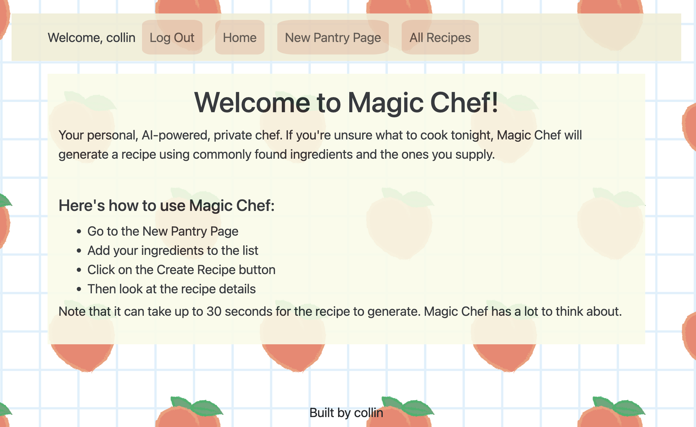
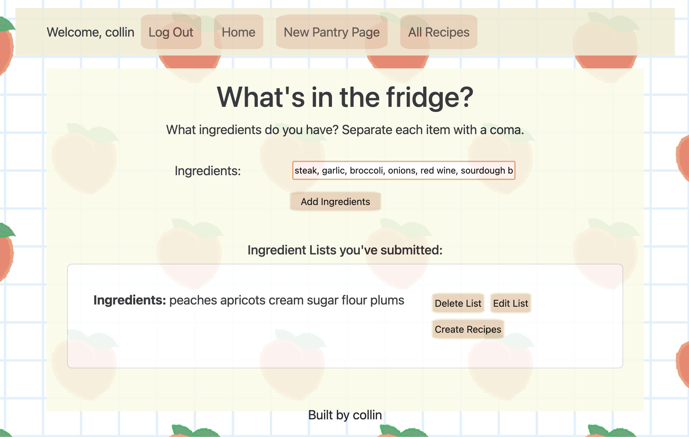
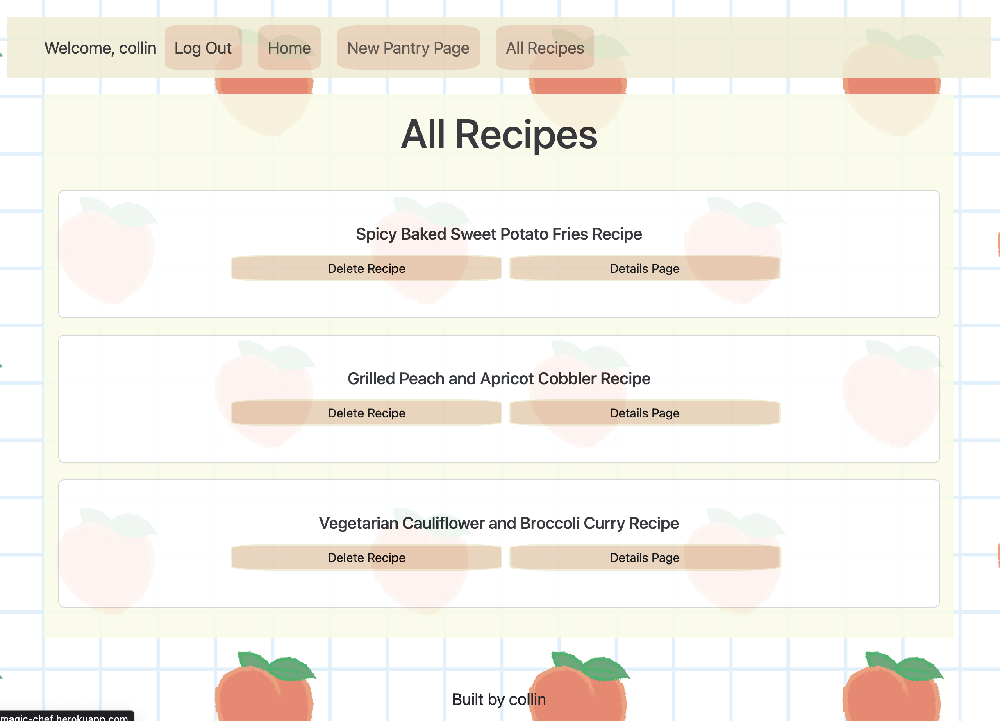
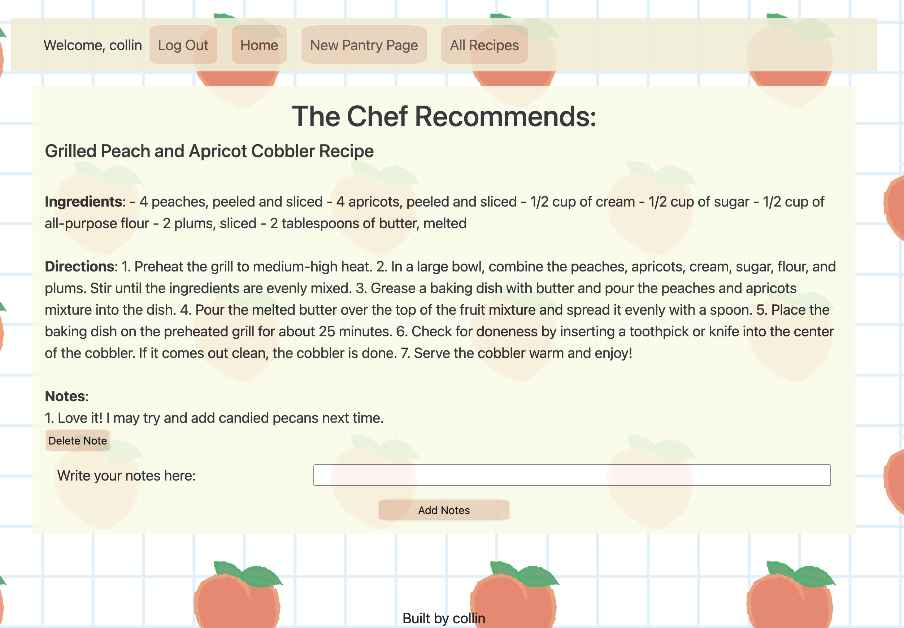

# Magic-Chef

# <strong><em> [Magic Chef])https://magic-chef.herokuapp.com/) </em></strong>: AI powered recipe generation tool with a mobile first design, and friendly user flow. All a user needs to do is provide a list of ingredients, and watch the power of AI return a delicious idea. 

The time is now, to say no to the stress of uncertain dinner plans!

## Magic Chef Overview

This website is very simple to use. After logging in, a user navigates to the New Pantry Page and adds a list of their ingredients. 
  

  

  
From there, they can create a recipe with a single button click, and once the recipe returns they are redirected to the AllRecipes Page. This stores all of a user's recipes, where they can delete, or move into the details page. 
  
  
  
The Details Page, explains the recipe's instructions, and has the functionality for a user to make notes on said recipe. Giving them the option to tweak and make the recipe their own. 
  

  
 ## Next Steps:

1. Add conditional rendering for a more dynamic UI
2. Refine the AI Prompt to be more specific/instructional
3. Have the AI Prompt return a structured response that can involve more data destructuing (cuisine, other recipe recommendations, common ingredients to add that would elevate the recipe)
4. Implement a forum component that allows a user to share their recipes, and comment on other users' recipes. 
5. Finesse the styling
  
 ## Technologies Used

## Notable Mentions:
  
  * The AI being leveraged is OpenAI's DaVinci Model. This uses an API call to send and receive data
  * The drop down NavBar comes from Benny. You can see his blog post [here](https://dev.to/thejourneyville/bootstrap-51-navbar-and-hamburger-toggler-4m9h).
  * The CSS loading animation comes from HubSpot. You can see their blog post [here](https://blog.hubspot.com/website/css-loading-animation).
  * The background image was downloaded from RawPixel at Freepik, and can be found [here](https://www.freepik.com/free-vector/hand-drawn-peach-seamless-pattern-white-grid_16398497.htm#query=strawberry%20graphic&position=39&from_view=keyword&track=ais).
 
  
## Project Planning Links:

API: OpenAI Text Completion Guide [OpenAi](https://platform.openai.com/docs/guides/completion/introduction)

TRELLO [Trello](https://trello.com/invite/b/tBpX9Gzk/ATTI59503739140a04329c7d6576fae8fffb619A3BEF/project-4)

WIREFRAME [Wireframe](https://whimsical.com/magic-chef-wireframe-B48yXvFYpwDH9TVwXqfeeX)

ERD [ERD](https://lucid.app/lucidchart/609dcab5-73b2-47c5-8ae7-0c050f1fa3d6/edit?viewport_loc=-4%2C-110%2C2282%2C1324%2C0_0&invitationId=inv_f393d7ef-0707-4152-9882-3d15efa74679)
